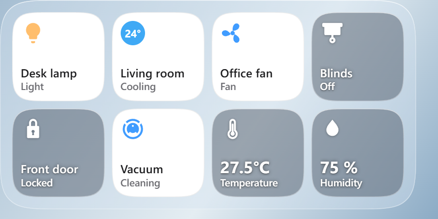
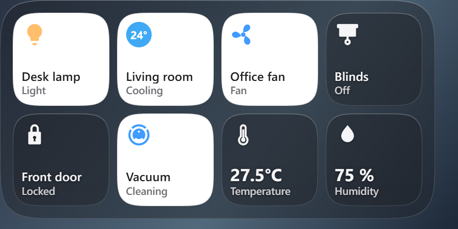
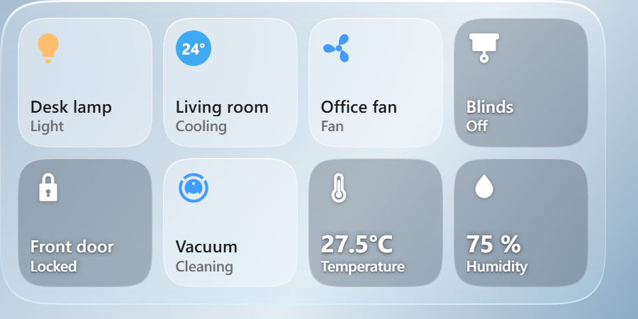
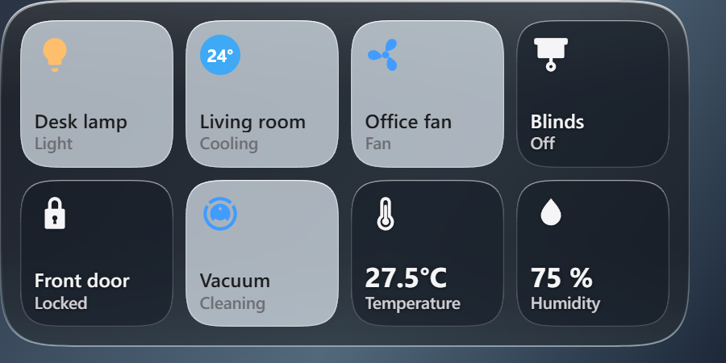
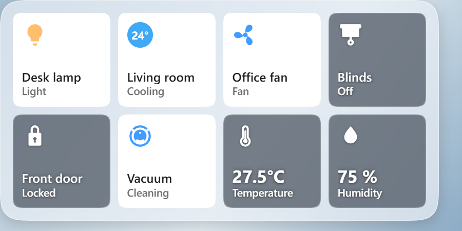
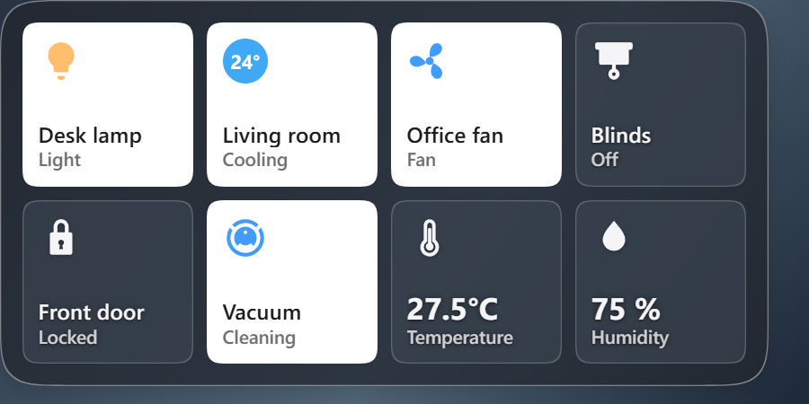
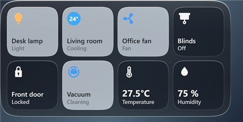
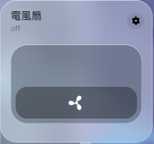
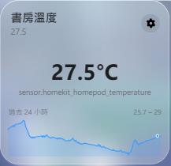
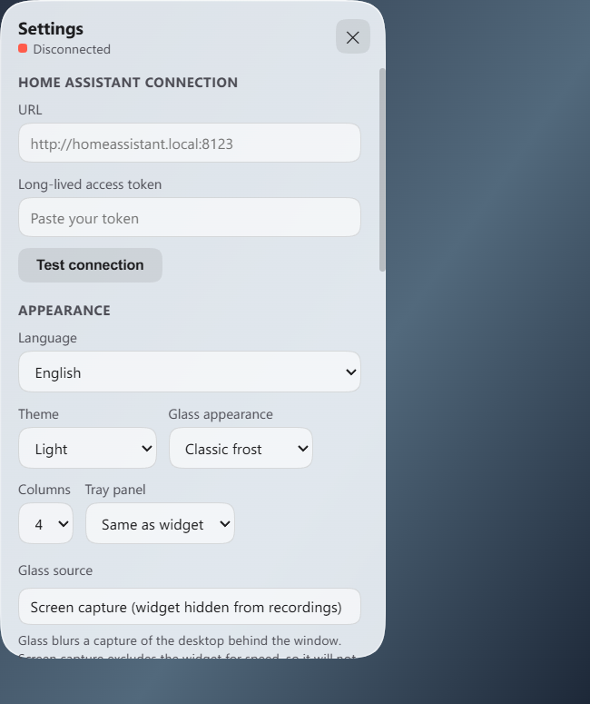

# HA Widgets

Home Assistant controls on your Windows desktop. Built with Qt, with a
frosted-glass background and transparent rounded corners.

## Themes

These screenshots use demo devices and show the actual Qt interface in each
appearance. The glass effect varies with your wallpaper.

| Appearance | Light | Dark |
| --- | --- | --- |
| Classic frost |  |  |
| Liquid glass |  |  |
| Windows glass |  |  |

| Tray panel | Device controls | Sensor history |
| --- | --- | --- |
|  |  |  |



## Features

- **Desktop controls:** keep your devices on the desktop, drag to reposition, and lock in place.
- **Live updates:** device states update through Home Assistant's WebSocket API.
- **Quick access:** click the tray icon to open a panel beside the taskbar.
- **Device details:** right-click or hold a tile for additional controls and sensor history.
- **Personalization:** light and dark themes; classic, liquid, and Windows glass; columns, zoom, fixed size, and glass sample rate.
- **Dimming:** the widget dims while the desktop is covered and returns when you go back to it or click it.
- **Languages:** Traditional Chinese and English.

In a device's detail view, open the edit panel to choose an icon or enter a
Material Design Icons name such as `mdi:air-conditioner`. Without a chosen
icon, the entity's `mdi:` icon from Home Assistant is used. Icons are bundled
for offline use.

The liquid appearance ports the rounded-rectangle distance and edge
displacement from [KMPLiquidGlass's Skia Lens.kt](https://github.com/Kashif-E/KMPLiquidGlass/blob/master/backdrop/src/skiaMain/kotlin/com/kashif_e/backdrop/effects/Lens.kt)
to a WebGL shader (with a Canvas fallback) over a capture of the desktop.
It samples once per display frame, and may fall below the refresh rate when
capturing takes longer than a frame.

## Glass source

Settings → **Glass source**:

- **Screen capture** (default): fast, but hides the widget from screenshots
  and screen recordings.
- **Compatibility**: keeps the widget visible in recordings and renders the
  wallpaper more slowly. Some GPU-rendered applications behind the tray
  panel may not appear in its glass.

## Run

For a packaged release, run `HA-Widgets-Setup-<version>.exe`. Run a newer
installer to upgrade; your settings are preserved.

To run from source (Windows 10/11, Python 3.12):

```powershell
pip install -r requirements.txt
python main.py
```

Open Settings, enter your Home Assistant URL and a
[long-lived access token](https://www.home-assistant.io/docs/authentication/#your-account-profile),
then choose your devices. Settings are stored in `ha_widgets_config.json`
next to `main.py` when running from source, or in `%APPDATA%\HA Widgets`
for an installed build.

## Development

- Tests: see [tests/README.md](tests/README.md).
- Installers: see [packaging/README.md](packaging/README.md).
- README screenshots: `python packaging/render_readme.py` regenerates them
  from demo data.

## License

[MIT](LICENSE)

Bundled Material Design Icons path data: [Apache 2.0](web/mdi-LICENSE).
