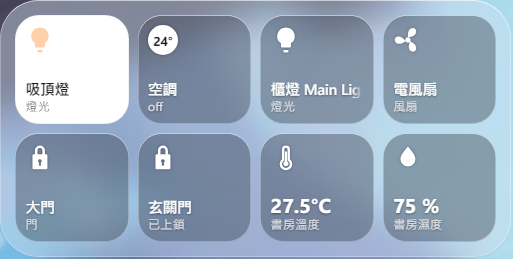

# HA Widgets

Home Assistant controls on your Windows desktop. Built with Qt, with a
frosted-glass background and transparent rounded corners.



- **Desktop controls:** keep your devices on the desktop, drag to reposition, and lock in place.
- **Live updates:** device states update through Home Assistant's WebSocket API.
- **Quick access:** click the tray icon to open a panel beside the taskbar.
- **Device details:** right-click or hold a tile for additional controls and sensor history.
- **Personalization:** light and dark themes, classic, liquid, and Windows glass appearances, adjustable size, zoom, and opacity.

The liquid appearance ports the rounded-rectangle distance and edge
displacement from [KMPLiquidGlass's Skia Lens.kt](https://github.com/Kashif-E/KMPLiquidGlass/blob/master/backdrop/src/skiaMain/kotlin/com/kashif_e/backdrop/effects/Lens.kt).
The backdrop is captured from the desktop and sampled in Canvas; the
Kotlin shader itself cannot run inside this Qt WebView.
Liquid mode schedules each new backdrop sample on the display's next
animation frame after the previous capture finishes. Actual sampling can
fall below the refresh rate when capture, transfer, or rendering takes
longer than one frame.

| Tray panel | Device controls | Sensor history |
| --- | --- | --- |
|  |  |  |

## Run

For a packaged release, run `HA-Widgets-Setup-<version>.exe`. Run the newer
installer to upgrade; your settings are preserved.

To run from source: Windows 10/11 and Python 3.12.

```powershell
pip install -r requirements.txt
python main.py
```

Open Settings, enter your Home Assistant URL and a
[long-lived access token](https://www.home-assistant.io/docs/authentication/#your-account-profile),
then choose your devices.

Fast glass hides the widget from screenshots and recordings. Choose compatibility
mode to include it; background capture depends on the applications behind it.

## License

[MIT](LICENSE)
