# Home Assistant Desktop Widget for Windows (HA Widgets)

English | [繁體中文](README.zh-TW.md)

Home Assistant controls on your Windows 10/11 desktop. A lightweight desktop
widget with a frosted-glass or liquid-glass background and transparent rounded
corners, plus a system tray panel for quick access. Built with Qt.

**[Download the latest installer](https://github.com/daniellee0522/home-assistant-desktop-widget/releases/latest)**
(`HA-Widgets-Setup-<version>.exe`; settings are kept when you upgrade).

## Themes

These screenshots use demo devices and show the actual Qt interface in each
appearance. The glass effect varies with your wallpaper.

| Appearance | Light | Dark |
| --- | --- | --- |
| Classic frost | 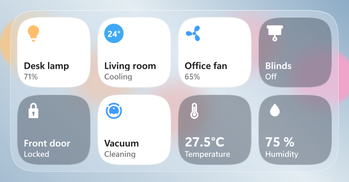 | 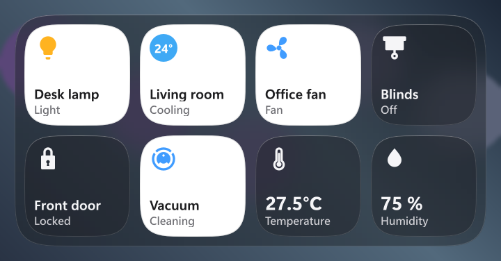 |
| Liquid glass | 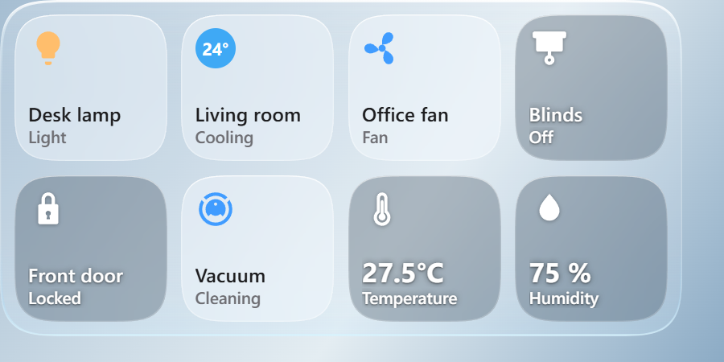 | 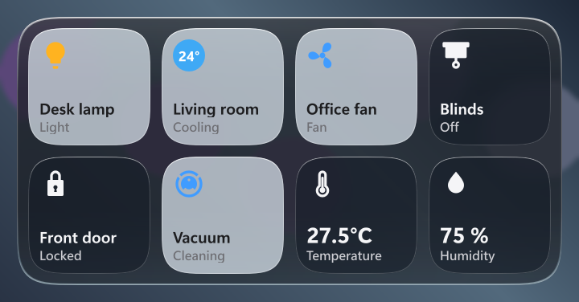 |
| Windows glass | 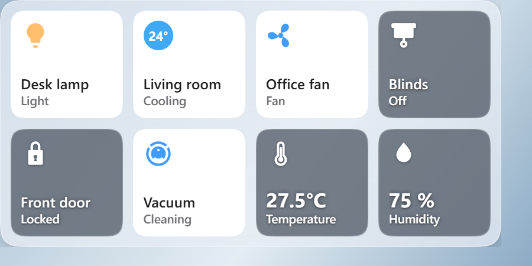 | 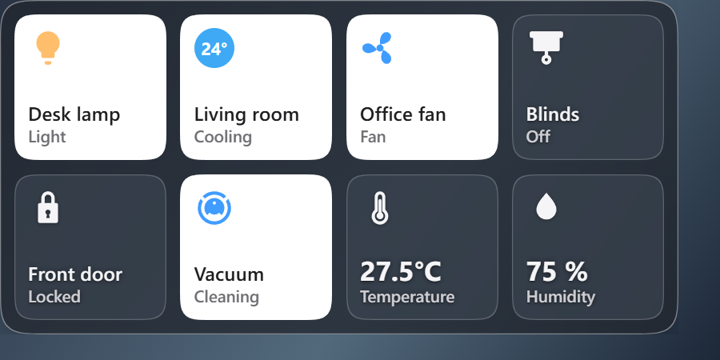 |

| Tray panel | Device controls | Sensor history |
| --- | --- | --- |
| 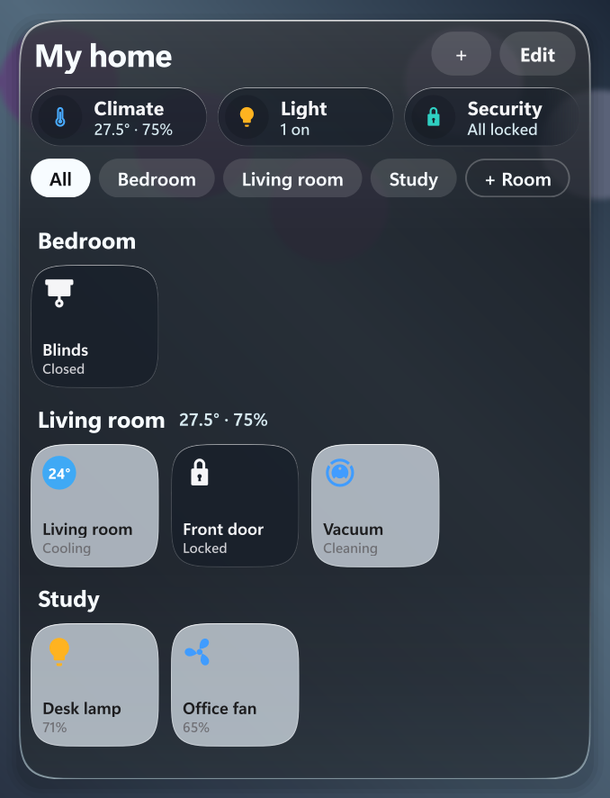 | 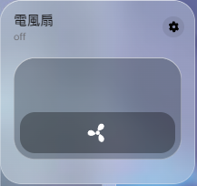 | 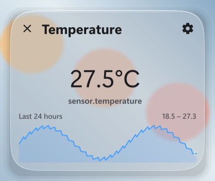 |

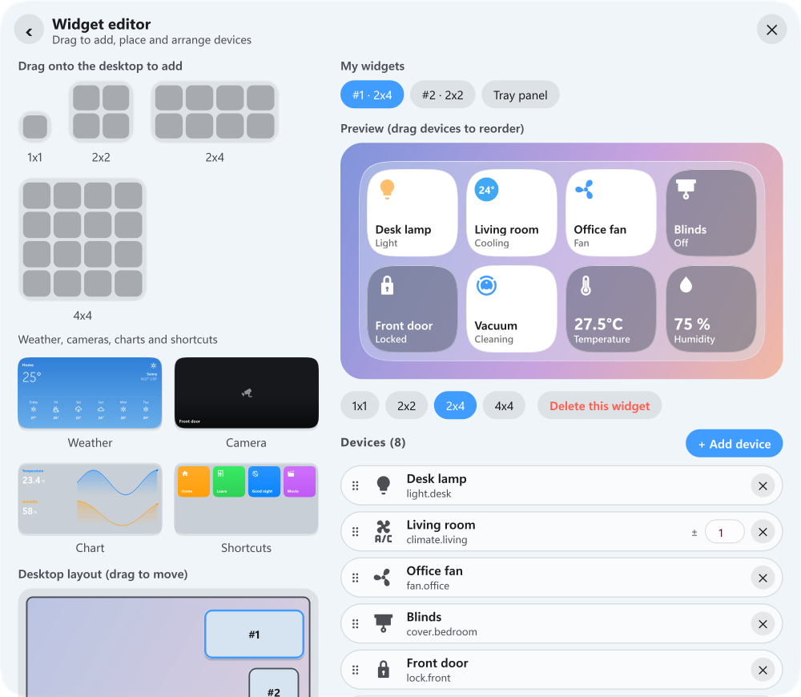

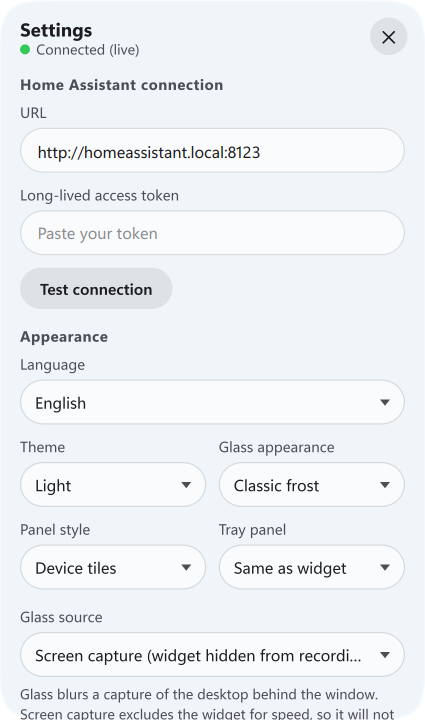

## Features

- **Multiple widgets:** place as many widgets as you like in four sizes (1x1, 2x2, 2x4, 4x4), each with its own devices. Tiles fill the widget as small squares, wide bars or large squares, always the same size and spacing, and snap to each other and to the screen edges.
- **Visual editor:** Settings → Open widget editor. Drag a size onto the desktop to add a widget, drag the boxes on the layout map to move them, drag devices to reorder. Right-click a widget on the desktop to edit it directly.
- **Desktop controls:** keep your devices on the desktop, drag to reposition, and lock in place.
- **Live updates:** device states update through Home Assistant's WebSocket API.
- **Quick access:** click the tray icon to open a panel beside the taskbar. The panel has its own device list (edit it as "Tray panel" in the widget editor, or let it show every widget's devices); it shows two rows and scrolls past eight. Or switch Settings → **Panel style** to **Home style**: every device grouped by room (your Home Assistant areas, which you can override per device from its detail card), with capsules for the kinds of device (climate, lights, security with locks and cameras, media; shown only if you have them), room capsules with a button to add your own rooms, and the usual click, hold and right-click controls. Press a capsule and the rooms recede while that kind of device comes forward; press it again or the empty space to go back. Temperature and humidity are status, as a range where a room has several. Press **Edit** to drag rooms (the capsules or a room's heading) into a new order, hide a whole room, drag tiles (press and hold) between rooms, pull a tile's corner to make it a square, bar or large square, remove tiles (**+** brings them back), and switch rooms on or off. Settings → **Panel background picture** puts your own picture, blurred, behind the panel.
- **Device details:** right-click or hold a tile for additional controls and sensor history.
- **Personalization:** light and dark themes; classic, liquid, and Windows glass; zoom, and fixed widget sizes. The glass follows changes on screen; there is no refresh rate to set.
- **Light on resources:** the desktop widgets are drawn natively, not as browser pages, so the whole program rests at about 65 MB and close to 0 % CPU on a still desktop; the settings window, detail card and tray panel are web pages made only when opened and released again after a while. Over a video wallpaper, choose **Still** glass updates to sample only when a widget moves.
- **Dimming:** the widget dims while the desktop is covered and returns when you go back to it or click it.
- **Languages:** Traditional Chinese and English.

In a device's detail view, open the edit panel to choose an icon or enter a
Material Design Icons name such as `mdi:air-conditioner`. Without a chosen
icon, the entity's `mdi:` icon from Home Assistant is used. Icons are bundled
for offline use.

The liquid appearance ports the rounded-rectangle distance and edge
displacement from [KMPLiquidGlass's Skia Lens.kt](https://github.com/Kashif-E/KMPLiquidGlass/blob/master/backdrop/src/skiaMain/kotlin/com/kashif_e/backdrop/effects/Lens.kt)
over a capture of the desktop. The ring the lens bends depends only on the card's shape, so it is worked out once as a mesh and each new picture is warped through it (no GPU needed). Settings → **Liquid glass blur** goes from 0 (the clearest, sharpest refraction) to 100 (close to the classic frost).
Screen capture uses DXGI Desktop Duplication: Windows reports which parts of
the screen changed, and the glass is refreshed only when the area behind a
window did, up to about 30 times a second, and a still desktop costs no captures
at all. Settings → **Glass updates**: *Live* follows every change (an animated
wallpaper such as Wallpaper Engine changes it constantly; while it is paused
nothing is captured), *Still* takes the picture once and again only when the
widget moves or resizes.

## Glass source

Settings → **Glass source**:

- **Screen capture** (default): fast, but hides the widget from screenshots
  and screen recordings.
- **Compatibility**: keeps the widget visible in recordings and renders the
  wallpaper more slowly. Some GPU-rendered applications behind the tray
  panel may not appear in its glass.

## Run

For a packaged release, run `HA-Widgets-Setup-<version>.exe`. Run a newer
installer to upgrade; your settings are preserved.

To run from source (Windows 10/11, Python 3.12):

```powershell
pip install -r requirements.txt
python main.py
```

Open Settings, enter your Home Assistant URL and a
[long-lived access token](https://www.home-assistant.io/docs/authentication/#your-account-profile),
then choose your devices. Settings are stored in `ha_widgets_config.json`
next to `main.py` when running from source, or in `%APPDATA%\HA Widgets`
for an installed build.

## Development

- Tests: see [tests/README.md](tests/README.md).
- Installers: see [packaging/README.md](packaging/README.md).
- README screenshots: `python packaging/render_readme.py` regenerates them
  from demo data.

## License

[MIT](LICENSE)

Bundled Material Design Icons path data: [Apache 2.0](web/mdi-LICENSE).
