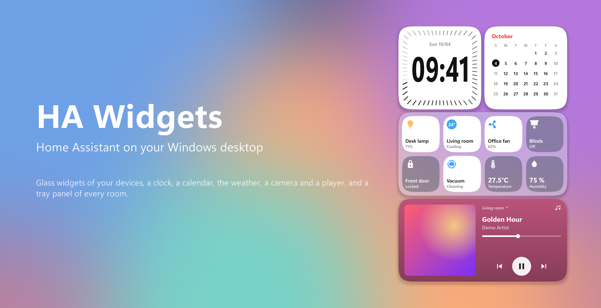
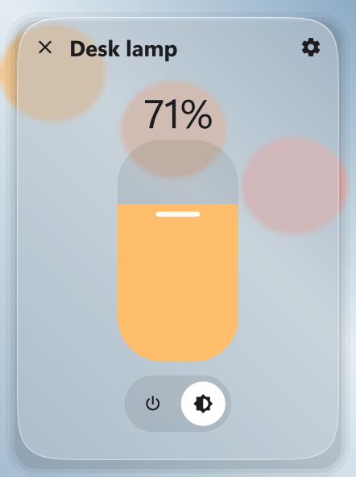
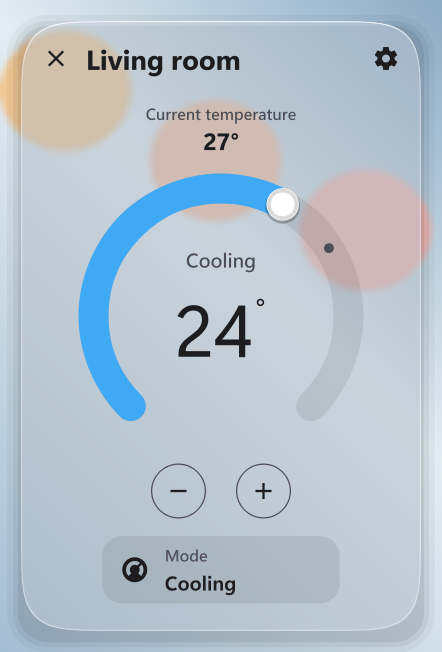
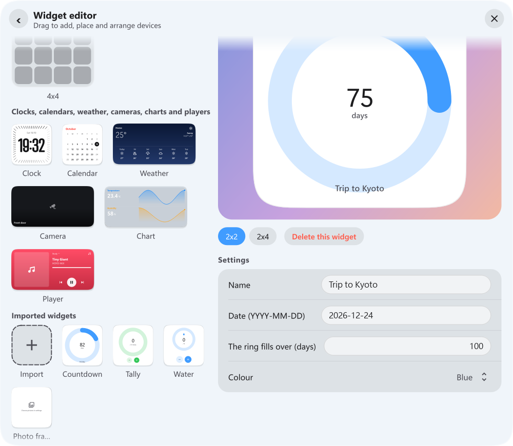

# Home Assistant 桌面小工具（Windows）— HA Widgets



[English](README.md) | 繁體中文

**把智慧家庭放上 Windows 桌面，像蘋果做的一樣。**

半透明的玻璃磁貼浮在桌布上，即時顯示燈光、空調、門鎖與播放器。點一下切換、長按進入完整控制，
點系統匣圖示就是依房間分類的 Home 風格面板。非常輕巧：桌面靜止時約 50 MB、CPU 接近 0 %。
使用 Qt 繪製，程式裡沒有瀏覽器引擎。

**[下載最新安裝檔](https://github.com/daniellee0522/home-assistant-desktop-widget/releases/latest)**
（`HA-Widgets-Setup-<版本>.exe`；升級時會保留你的設定）。

## 為什麼會喜歡

- **看起來就是系統的一部分。** 經典毛玻璃、會折射桌布的液態玻璃，或 Windows 玻璃，淺色深色皆有。
- **不只是磁貼。** 時鐘、日曆、天氣、攝影機、圖表與音樂播放器，每種都是可以拖到桌面的獨立 widget。
- **即時。** 狀態透過 WebSocket 即時送達；點下去立刻有反應，不用等 Home Assistant 回覆。
- **一個面板掌握全家。** 點系統匣（或按 Ctrl + Alt + H）依房間列出所有裝置；長按任一磁貼有旋鈕、滑桿或播放控制。
- **安靜。** 你忙別的事時 widget 會自動變暗（變暗的時鐘完全靜止），桌面靜止時幾乎不耗資源。
- **由你決定。** 拖曳排列、吸附邊緣、自選圖示、自訂房間，支援繁體中文與英文。
- **自己做 widget。** 匯入別人寫的 widget（倒數日、股價、相框…），或用一個 Python 檔自己寫，也可以用文字或圖片描述給 AI 幫你寫再匯入；每一個都有自己的設定。

## 外觀

下列截圖使用示範裝置，呈現實際的 Qt 介面。玻璃效果會隨桌布而不同。

| 外觀 | 淺色 | 深色 |
| --- | --- | --- |
| 經典毛玻璃 |  |  |
| 液態玻璃 |  |  |
| Windows 玻璃 |  |  |

<table>
<tr align="center">
<td><b>Home 風格系統匣面板</b></td><td><b>燈光</b></td><td><b>空調</b></td><td><b>感測器歷史</b></td>
</tr>
<tr align="center" valign="bottom">
<td></td>
<td></td>
<td></td>
<td></td>
</tr>
</table>


## 完整功能

- **多個 widget：** 可放任意數量、四種尺寸（1x1、2x2、2x4、4x4）的 widget，各自有自己的裝置。磁貼會依 widget 大小以小方塊、長條或大方塊填滿，大小與間距一致，並可互相吸附、貼齊螢幕邊緣。
- **Widget 類型：** 除了配件磁貼（場景、腳本也是磁貼，點一下執行），還有**時鐘**與**日曆**（iOS 風格錶面，不需要配件）、**天氣**（依天氣變化的背景、今日高低溫、未來幾天預報）、**攝影機**（即時畫面，每幾秒更新，桌面被蓋住時暫停）、兩個感測器的**圖表**（過去一天的曲線）與**播放器**（封面、歌曲與進度，上一首／播放／下一首）。它們是各自獨立的 widget：從 Widget 編輯器左側拖到桌面即可新增，大小固定（新的天氣、攝影機或播放器 widget 會先帶入你的第一個）。待機時所有類型都會像磁貼一樣變成透明玻璃。
- **圖示代表種類：** 磁貼的圖示決定它是什麼。開關可以改成燈具、風扇、門鎖、空調、影音或家電，顏色、狀態文字和控制畫面都會跟著改變；其他設備則提供同類型的不同造型（吸頂燈、立燈；門、柵門）；其他圖示只換圖案。編輯面板會分開顯示這兩類，並有「重置」。所有磁貼名稱下方都顯示狀態（感測器顯示數值）。
- **視覺化編輯器：** 設定 → 開啟 Widget 編輯器。把尺寸（或時鐘、日曆、天氣、攝影機、圖表、播放器 widget）拖到桌面即新增 widget，拖曳配置圖上的方塊移動位置，拖曳配件調整順序：拖著的配件跟著游標，其他配件會即時讓出位置預覽結果。「新增配件」可以一次勾選多個（或整組全選）；也可以直接在桌面上對 widget 按右鍵編輯。
- **桌面控制：** 把裝置放在桌面上，可拖曳重新擺放，也能鎖定位置。
- **即時更新：** 透過 Home Assistant 的 WebSocket API 即時更新裝置狀態。
- **快速存取：** 點擊系統匣圖示，在工作列旁開啟面板。面板可有自己的配件清單（在 Widget 編輯器選「系統匣面板」編輯，或讓它顯示所有 widget 的配件），一次顯示三列，超過十二個可捲動。也可在設定 → **面板樣式** 改成 **Home 風格**：所有裝置依房間（Home Assistant 的區域，可在裝置詳情卡片中逐一改房間）分組，頂端是分類膠囊（環境溫濕度、燈光、保全系統（門鎖與攝影機）、媒體音訊，沒有該類配件就不顯示），房間也是膠囊，可自行新增房間，操作方式（點擊、長按、右鍵）與一般磁貼相同。按下膠囊時房間畫面會縮入淡出，該類配件浮現；再按一次膠囊或空白處即可退回。溫度與濕度以狀態顯示，同一房間有多個時顯示範圍。按「編輯」可拖曳房間（膠囊或房間標題）調整順序、隱藏整個房間、拖曳磁貼到其他房間、拉磁貼右下角改成方塊／長條／大方塊、移除磁貼（「＋」可加回）、選擇主畫面顯示哪些房間，也可以按房間膠囊上的 **✕** 刪除房間（裡面的配件會歸到「未分類」，未分類預設不在主畫面顯示；「＋」可還原刪除的房間）。在面板裡長按或右鍵磁貼，控制項會直接浮現在面板中、蓋在磁貼上方，並縮放到不需捲動（模式、風速、預設模式、來源等選項會以浮動選單開啟）；按 **✕**、旁邊的空白處或 Esc 返回。設定 → **面板背景圖片** 可在面板後方放自己的圖片（先套用模糊）。面板在不同顯示器上佔畫面的比例大致相同（大螢幕或高解析度時放大、小螢幕時縮小，且不會超出可用範圍）。
- **裝置詳情：** 右鍵或長按磁貼，開啟裝置自己的控制畫面（參照 Home Assistant）：燈光、風扇、窗簾用直式滑桿，空調用溫度圓盤，媒體有封面、進度與播放控制，門鎖用直式開關，感測器有歷史曲線。
- **快捷鍵：** 在任何地方按 **Ctrl + Alt + H** 即可開關系統匣面板。可在設定 → 行為按下其他組合，或清除。
- **警示通知（預設關閉）：** 在設定 → 通知開啟後，widget 或面板上的門鎖被解鎖、打開或卡住，或安全感測器觸發（門窗打開、漏水、煙霧、瓦斯、一氧化碳等）時，以 Windows 通知提醒。只通知變化，不會通知啟動時的狀態，同一件事一分鐘內只提醒一次。
- **個人化：** 淺色／深色主題；經典、液態、Windows 三種玻璃；可調縮放與固定 widget 大小；桌布一直在動時，設定 → **玻璃更新率** 可選每秒 30、20 或 15 次（越少越省處理器）。
- **省資源：** 所有視窗都直接原生繪製，程式裡完全沒有瀏覽器引擎：桌面 widget、詳情卡、系統匣面板與設定都是。常駐約 50 MB 記憶體，桌面靜止時 CPU 接近 0 %；開啟面板或設定時約 70～90 MB（開啟時才建立，閒置一段時間後釋放）。使用影片桌布時，可把「毛玻璃更新」設為靜態，只在移動 widget 時取樣。
- **自動變暗：** 桌面被其他視窗蓋住時 widget 會變暗，回到桌面或點擊時恢復。變暗的時鐘靜止不動：外圈刻度淡而均勻，沒有跳動的秒針，桌面被蓋住時每秒不會重繪。
  點擊工作列、開始功能表或 widget 自己的面板，不會取消變暗。
- **自訂 widget：** 見[自訂 Widget](#自訂-widget)。
- **語言：** 繁體中文與英文。

在裝置的詳情畫面中開啟編輯面板，可以選擇圖示，或輸入 Material Design Icons
名稱，例如 `mdi:air-conditioner`。未選擇時會使用 Home Assistant 提供的 `mdi:`
圖示。圖示已內建，可離線使用。

## 自訂 Widget



Widget 不限於 Home Assistant：倒數日、股價、天氣、可放十張圖（靜態、GIF、WebP）的相框、計數器、電池、世界時鐘……。一個 widget 就是一個 Python 檔，
說明它顯示什麼、資料從哪來、使用者能改什麼、按下去會怎樣；玻璃與待機變暗由程式負責，設定視窗由設定項目自動做出來，它想做的事（連網、錄音…）會先問使用者。

- **加入：** 設定 → 開啟 Widget 編輯器 →「匯入的 Widget」下的 **＋** → 選 `.hawidget` 檔（或 `.py`），再像時鐘一樣拖到桌面。每一個都有自己的設定；它要求的權限
  是一個開關、只回答一次，有風險的預設關閉。Widget 是程式，請只匯入你信任的人寫的。
- **自己寫：** 見 [docs/widgetkit.zh-TW.md](docs/widgetkit.zh-TW.md)（中文教學）與 [docs/widgetkit.md](docs/widgetkit.md)（英文參考）。
  `python -m widgetkit.studio my_widget.py` 即時預覽每個尺寸、亮暗主題與更長的假語言；`python -m widgetkit.check my_widget.py --pack my.hawidget` 列出問題並打包。
- **請 AI 寫：** 專案內附 Claude 技能 `ha-widget-author`（[.claude/skills/ha-widget-author](.claude/skills/ha-widget-author)；
  [docs/ha-widget-author.skill](docs/ha-widget-author.skill) 可獨立安裝）。用文字描述，或附上喜歡的 widget 截圖，它會寫出檔案、檢查、看預覽圖修正，
  最後給你一個可匯入的 `.hawidget`。

## 毛玻璃來源

設定 → **毛玻璃來源**：

- **畫面擷取**（預設）：速度快，但 widget 不會出現在螢幕截圖與錄影中。
- **相容模式**：widget 可出現在錄影中，但桌布渲染較慢。系統匣面板後方某些
  由 GPU 繪製的程式，可能不會出現在面板的玻璃中。

液態玻璃移植自 [KMPLiquidGlass 的 Lens.kt](https://github.com/Kashif-E/KMPLiquidGlass/blob/master/backdrop/src/skiaMain/kotlin/com/kashif_e/backdrop/effects/Lens.kt)；折射環只取決於卡片形狀，因此預先算好成網格，每張新畫面只要經過網格扭曲一次（不需要 GPU）。設定 → **液態玻璃模糊度** 從 0（最透明、折射最清楚）到 100（接近經典毛玻璃）。

螢幕擷取使用 DXGI Desktop Duplication：Windows 會回報螢幕哪些區域有變化，
只有視窗後方的畫面改變時才會更新玻璃，最高約每秒 30 次；畫面靜止時完全不會擷取。
設定 → **毛玻璃更新**：*動態* 隨每次變化更新（Wallpaper Engine 這類動態桌布會一直變化，暫停時則不擷取）；*靜態* 只取樣一次，之後只在 widget 移動或調整大小時重新取樣。

## 安裝與執行

安裝版：執行 `HA-Widgets-Setup-<版本>.exe`。要升級時直接執行新版安裝檔，設定會保留。

從原始碼執行（Windows 10/11、Python 3.12）：

```powershell
pip install -r requirements.txt
python main.py
```

開啟設定，輸入你的 Home Assistant 網址與
[長期存取權杖](https://www.home-assistant.io/docs/authentication/#your-account-profile)，
再選擇要顯示的裝置。設定檔在原始碼執行時存於 `main.py` 旁的
`ha_widgets_config.json`，安裝版則存於 `%APPDATA%\HA Widgets`。

## 開發

程式分成 `app/`（執行中的程式與 Api）、`core/`（設定與 Home Assistant）、`winsys/`（Windows、畫面擷取、系統匣）與
`nativeui/`（所有視窗的繪製）；`main.py` 只負責啟動。各部分的分工見 [docs/architecture.md](docs/architecture.md)。

- 安裝檔：見 [packaging/README.md](packaging/README.md)。
- 修改時要遵守的規則：[CLAUDE.md](CLAUDE.md)。

## 授權

[MIT](LICENSE)

內建的 Material Design Icons 路徑資料：[Apache 2.0](nativeui/mdi-LICENSE)。
